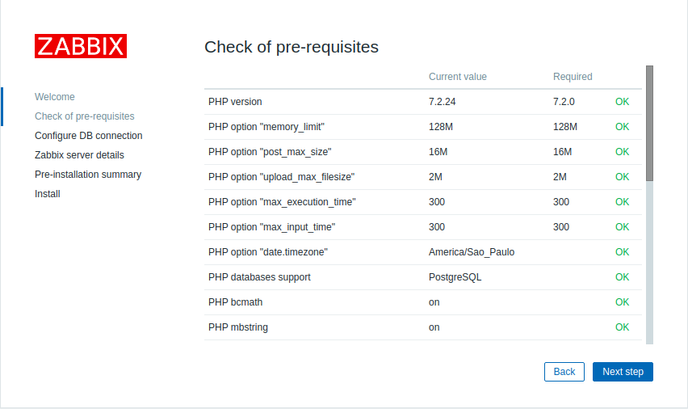
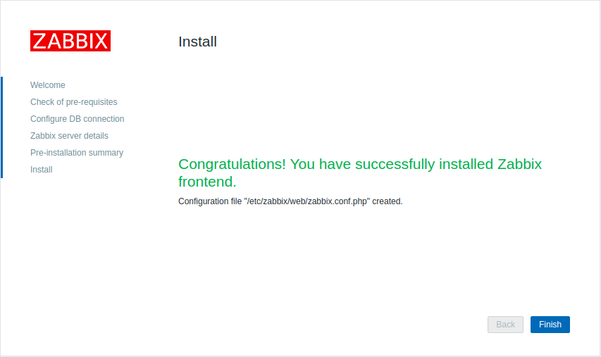

# Instalação Zabbix 5.0 + CentOS 8 + Nginx + PostgresSQL


## 1 - Dependências e pacotes de linguagens

```sh
$ sudo dnf -y update
$ sudo dnf -y install vim net-tools mlocate wget curl langpacks-en langpacks-pt_BR glibc-all-langpacks
```


## 2 -  SELinux e Firewall

```sh
$ sudo setenforce 0 && sudo sed -i 's/^SELINUX=.*/SELINUX=permissive/g' /etc/selinux/config

$ sudo firewall-cmd --add-service={http,https} --permanent
$ sudo firewall-cmd --add-port={10051/tcp,10050/tcp} --permanent
$ sudo firewall-cmd --reload
```


## 3 - PostgresSQL

```sh
$ sudo dnf install -y https://download.postgresql.org/pub/repos/yum/reporpms/EL-8-x86_64/pgdg-redhat-repo-latest.noarch.rpm

$ sudo dnf -qy module disable postgresql
$ sudo dnf install -y postgresql12-server

$ sudo /usr/pgsql-12/bin/postgresql-12-setup initdb
$ sudo vim /var/lib/pgsql/12/data/pg_hba.conf
  METHOD  ident para md5

$ sudo systemctl enable postgresql-12
$ sudo systemctl start postgresql-12
```


## 4 - Zabbix

```sh
$ sudo rpm -Uvh https://repo.zabbix.com/zabbix/5.0/rhel/8/x86_64/zabbix-release-5.0-1.el8.noarch.rpm

$ sudo dnf clean all
$ sudo dnf -y install zabbix-server-pgsql zabbix-web-pgsql zabbix-nginx-conf zabbix-agent
```


## 5 - Banco (Zabbix)

```sh
$ sudo -u postgres createuser --pwprompt zabbix
$ sudo -u postgres createdb -O zabbix zabbix

$ zcat /usr/share/doc/zabbix-server-pgsql*/create.sql.gz | sudo -u zabbix psql zabbix
```


## 6 - Confs

```sh
$ sudo vim /etc/zabbix/zabbix_server.conf
  DBPassword=zabbixDBpass

$ sudo vim /etc/nginx/conf.d/zabbix.conf
  listen 80;
  zabbix.jodairneves.dev.br;

$ sudo vim /etc/php-fpm.d/zabbix.conf
  user = nginx
  group = nginx
  php_value date.timezone America/Sao_Paulo

$ sudo chown -R nginx.zabbix /usr/share/zabbix/
$ sudo chown -R nginx.zabbix /etc/zabbix/web/
$ sudo chown -R root.nginx /var/lib/php/
```


## 7 - Serviços

```sh
$ sudo systemctl enable zabbix-server zabbix-agent nginx php-fpm
$ sudo systemctl restart zabbix-server zabbix-agent nginx php-fpm
```

## 8 - Navegador

  * 8.1
    http://zabbix.jodairneves.dev.br

  * 8.2
  
  * 8.3
  
  * 8.4
  
  * 8.5
  
  * 8.6
  
  * 8.7
  
  * 8.8
  
  * 8.9
  